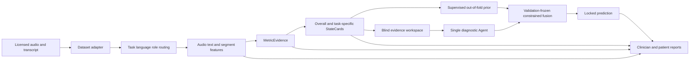
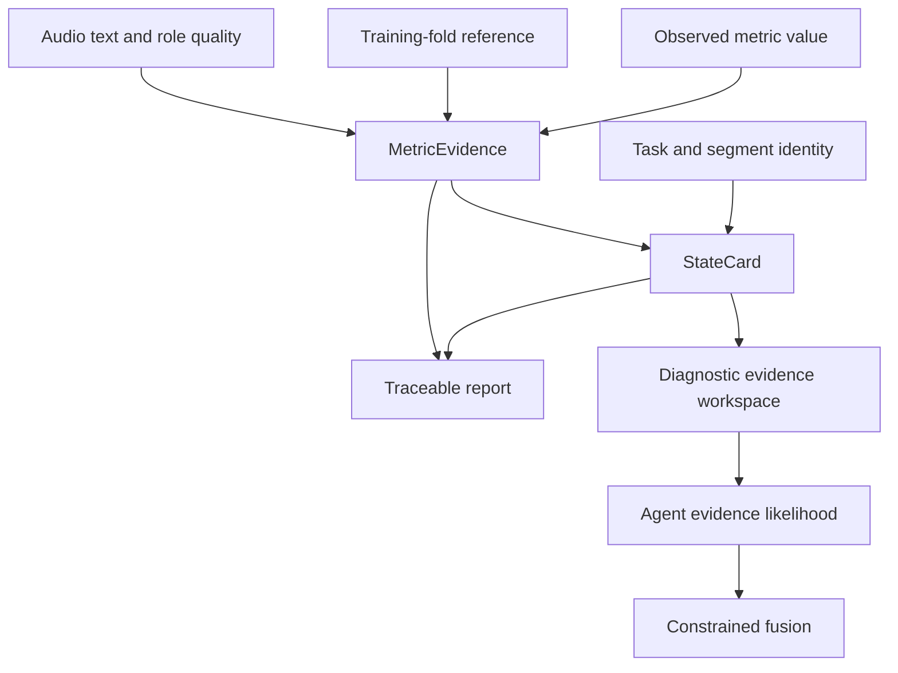

# Architecture

## Research pipeline

The Agent does not receive the supervised probability on its first evidence pass. It returns discrete evidence likelihoods and valid evidence identifiers. A validation-set gate determines whether those likelihoods may modify the supervised prior. Invalid output, insufficient evidence, confounding or failure to improve the development objective causes deterministic fallback.

## Evidence contract

Each MetricEvidence object records the observed value, expected direction, training-only reference, reliability, missingness, confound tags, task scope, source modality and report permission. StateCards combine correlated measurements once within a clinical construct and preserve supporting and counter-evidence IDs.

## Evaluation layers

- Layer A evaluates discrimination, classification, calibration and operating points on subject-disjoint predictions.
- Layer B evaluates evidence validity, leakage controls, fallback behavior, report permission, traceability, ablations, negative controls and Agent incremental value.
- Comparisons with published work are reported only when cohort, endpoint and protocol are compatible. Retrospective comparisons are not labelled confirmatory external validation.
